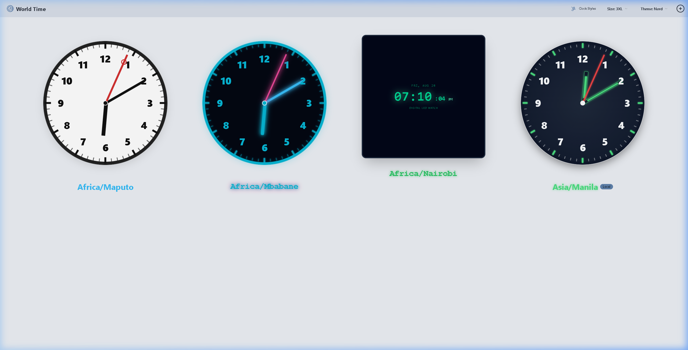

# World Time 🌐

> An elegant, feature-rich global time viewer app featuring few curated analog & digital clock designs, customizable themes, and drag-and-drop timezone tracking.


---

## 📸 Preview



---

## ✨ Features

- 🌍 **Global Timezone Dashboard**: Add, search, and track multiple world timezones simultaneously with automatic local timezone detection.
- 🎨 **25 Curated Clock Templates**:
  - **13 Analog Designs**: Swiss Railway (with signature red circle loop second hand), Luminous Tactical, Cyber Neon, Playful Colorful Kids, Dual Dial + LCD Screen, 24-Hour Military, Industrial Metal Cutout, Matte Black Wall, Rustic Walnut Wood, Vintage Roman, Minimalist Nordic, Dotted Rim, and Classic Standard.
  - **12 Digital Designs**: 7-Segment LED Watch, RGB Spectrum Rainbow, Atomic Weather Station, 3D Floating LED, Bedside Red Alarm, VFD Vacuum Tube, Nixie Glow, Cyberpunk Matrix, Retro Flip Card, Mini Pastel Desk, Modern Minimal Card, and Minimal Pill.
- 🕰️ **Theme-Matched Hand Tickers**: Every analog template features matching, handcrafted hour, minute, and second hand tickers with custom loops, luminescent stripes, and metallic accents.
- 🔀 **1-Click Display Mode Switch**: Seamlessly switch between **Analog** and **Digital** modes globally or per individual clock with a single button toggle.
- ✋ **Intuitive Drag-and-Drop**: Reorder your clock cards effortlessly by dragging and dropping them into your preferred layout.
- 🎨 **Themes & Responsive Slicing**: Choose from dark/light DaisyUI themes (Dracula, Nord, Cyberpunk, Forest, Synthwave, Light, Dark) and scale clock face sizes from Compact to 3XL.
- 🪄 **Clutter-Free Interface**: Card options and removal controls stay invisible until you hover over a clock card, keeping your dashboard sleek and clean.
- 💾 **Instant Local Storage Sync**: Your added timezones, chosen clock designs, display modes, and layout order automatically save and reload upon returning.

---

## 🚀 Ready to Use

You can run World Time locally in just 2 simple steps:

### 1. Install Dependencies
```bash
npm install
```

### 2. Launch Application
```bash
npm run dev
```

Open your browser and navigate to `http://localhost:5173` (or the URL output in your terminal) to start tracking global time.

---

## 💡 How to Use

1. **Add a Timezone**: Click the `+` button in the top right corner to open the timezone search drawer and select any city or region.
2. **Change Clock Designs**: Click the **Clock Styles** button in the header bar to browse and select global clock templates.
3. **Customize an Individual Clock**: Hover over any clock card and click the `⋮` menu in the upper right to switch its display mode or design independently.
4. **Reorder Clocks**: Click and drag any clock card to rearrange your dashboard layout.
5. **Remove a Clock**: Hover over a card and click **Remove**.

---

## 🛠️ Built With

- **[React 18](https://react.dev/)** - UI Component Library
- **[Redux Toolkit](https://redux-toolkit.js.org/)** - State Management & Local Storage Persistence
- **[TypeScript](https://www.typescriptlang.org/)** - Type-safe Application Logic
- **[TailwindCSS](https://tailwindcss.com/) & [DaisyUI](https://daisyui.com/)** - UI Design System & Component Styling
- **[Vite](https://vitejs.dev/)** - Lightning-fast Build Tool & Dev Server

---

## 📄 License

This project is open-source and available under the [MIT License](LICENSE).
